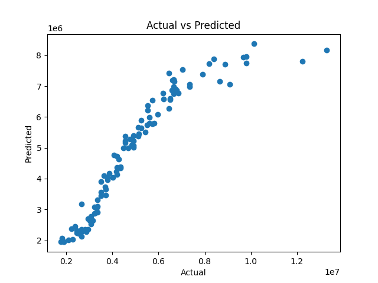

# Linear Regression

## Dataset
- **Source:** Kaggle Housing Dataset  
- **Link:** https://www.kaggle.com/datasets/ashydv/housing-dataset  

This dataset contains information about residential properties and their corresponding prices. It is used to predict house prices based on multiple features.

---

## Features Used
- area  
- bedrooms  
- bathrooms  
- stories  
- mainroad  
- guestroom  
- basement  
- hotwaterheating  
- airconditioning  
- parking  
- prefarea  
- furnishingstatus  

---

## Target Variable
- **price** → The selling price of the house  

---

## Model
- Algorithm: Linear Regression  
- Library: scikit-learn  

### Approach
- Data loading  
- Train-test split  
- Model training using Linear Regression  
- Prediction on test data  

---

## Results
- **Mean Squared Error (MSE):** 759299017153.7854  
- **R² Score:** 0.8498  

---

## Visualization

---

## Observations
- The model achieves a high R² score (~0.85), indicating a strong relationship between features and house prices  
- The MSE is large due to the high scale of house prices  
- The model performs reasonably well but still shows some prediction variance  

---

## Limitations
- Assumes linear relationship between features and target  
- Categorical features may not be optimally encoded  
- No advanced preprocessing applied  

---

## Future Improvements
- Apply feature scaling (StandardScaler / MinMaxScaler)  
- Use proper encoding for categorical variables  
- Try advanced models (Random Forest, Gradient Boosting)  
- Perform hyperparameter tuning  
- Compare performance with other models  

---

## Conclusion
This implementation demonstrates a complete Linear Regression pipeline including data processing, model training, evaluation, and visualization. It serves as a strong baseline for further improvements in house price prediction.